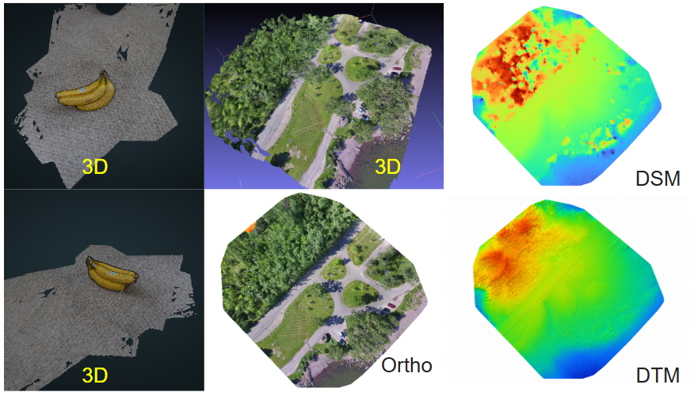

<!-- ---

title: 3D Modeling from Drone and Non-Drone Imagery
description: Generation of 3D models and photogrammetry products from drone and non-drone images using WebODM and ODX workflows.
image: assets/images/profile.png
tags:

* Photogrammetry
* 3D Modeling
* Drone Mapping
* WebODM
* ODX
* Remote Sensing

--- -->

# 3D Modeling from Drone and Non-Drone Imagery

## Overview

This project demonstrates the generation of 3D models from both drone and non-drone imagery using photogrammetry workflows. The workflow was tested on different image datasets, including banana plant imagery and drone images of a park area.

The workflow also generates high-level geospatial products such as Orthophoto, DSM, and DTM, which can support further analysis such as material-level damage assessment.

## Key Features

* 3D model generation from drone imagery
* 3D model generation from non-drone imagery
* Orthophoto generation
* Digital Surface Model (DSM) generation
* Digital Terrain Model (DTM) generation
* Point cloud generation
* Photogrammetry workflow using WebODM and ODX
* Command-line processing workflow

## Workflow

1. Collect and prepare drone or non-drone images.
2. Ensure sufficient image overlap for 3D reconstruction.
3. Prepare the project and image directory.
4. Process the imagery using WebODM or ODX.
5. Generate the 3D textured model and point cloud.
6. Generate Orthophoto, DSM, and DTM products.
7. Visualize and inspect the generated outputs.

## Technologies Used

* WebODM
* ODX
* Photogrammetry
* ExifTool
* MeshLab
* CloudCompare
* QGIS
* 3D Reconstruction

## Dataset

* **Drone Imagery:** Park area
* **Non-Drone Imagery:** Banana plant imagery
* **Example:** 16 images used for banana 3D model generation

## Results

| Output            | Result         |
| ----------------- | -------------- |
| Non-Drone Imagery | Banana imagery |
| Images Used       | 16 images      |
| Drone Imagery     | Park area      |
| 3D Model          | Generated      |
| Orthophoto        | Generated      |
| DSM               | Generated      |
| DTM               | Generated      |
| Point Cloud       | Generated      |

## Future Improvements

* Integrate the processing workflow into a web-based platform.
* Automate processing for faster 3D reconstruction.
* Support client-provided property imagery for 3D model generation.
* Integrate generated products into damage assessment workflows.
