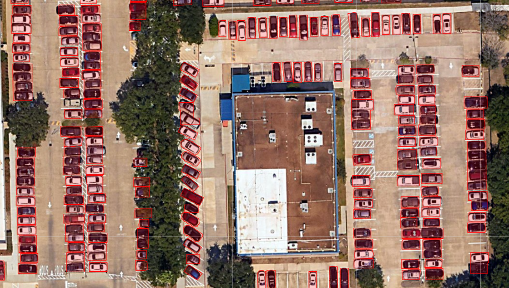

# Car Detection using GeoAI Mask R-CNN

## Overview

This project demonstrates automated car detection from high-resolution aerial imagery using the GeoAI framework. A Mask R-CNN model was trained on labeled vehicle data to detect cars and generate vector outputs for geospatial analysis.

## Key Features

- Object detection using Mask R-CNN
- High-resolution aerial imagery analysis
- Training with annotated vehicle datasets
- Automated inference on new imagery
- Vectorization of detected objects
- Visualization of detection results

## Project Workflow

1. Load aerial imagery and training labels.
2. Create image tiles for model training.
3. Train the Mask R-CNN object detection model.
4. Perform inference on unseen imagery.
5. Generate prediction masks.
6. Convert predictions into vector polygons.
7. Visualize the final detection results.

## Technologies Used

- Python
- GeoAI
- Mask R-CNN
- Rasterio
- GeoPandas
- Matplotlib
- Jupyter Notebook

## Dataset

- **Input:** High-resolution aerial imagery
- **Training Labels:** GeoJSON annotations
- **Task:** Car object detection

## Results

| Metric | Value |
|---------|------:|
| Model | Mask R-CNN |
| Pretrained Weights | Yes |
| Training Epochs | 100 |
| Learning Rate | 0.005 |
| Batch Size | 4 |
| Validation Split | 20% |

## Future Improvements

- Improve detection accuracy with additional training data.
- Experiment with different backbone architectures.
- Optimize inference speed for large datasets.
- Deploy the workflow for large-scale geospatial object detection.