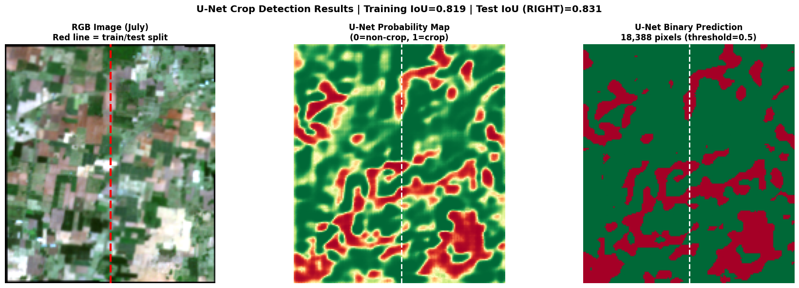

# Tamil Nadu Crop Mapping using Deep Learning

## Overview

This project demonstrates a crop mapping workflow using Sentinel-2 satellite imagery over an agricultural region in Tamil Nadu. The workflow includes satellite data acquisition, image preprocessing, temporal comparison, spectral analysis, and crop classification to identify agricultural patterns.

## Key Features

- Download Sentinel-2 imagery using STAC API
- Satellite image preprocessing and normalization
- Temporal comparison of multi-date imagery
- Spectral index calculation
- Crop classification workflow
- Visualization of crop mapping results

## Project Workflow

1. Define the study area.
2. Download Sentinel-2 satellite imagery.
3. Preprocess and normalize the imagery.
4. Compare multi-temporal satellite images.
5. Calculate spectral indices.
6. Perform crop classification.
7. Visualize the mapping results.

## Technologies Used

- Python
- Sentinel-2
- Rasterio
- NumPy
- Pandas
- Matplotlib
- PySTAC Client
- Jupyter Notebook

## Dataset

- **Source:** Sentinel-2 Satellite Imagery
- **Study Area:** Perani, Villupuram, Tamil Nadu
- **Data Access:** AWS Earth Search STAC API

## Results

| Metric | Value |
|---------|------:|
| Model | Simplified U-Net |
| Training Epochs | 15 |
| Accuracy | 86.70% |
| Precision | 89.84% |
| Recall | 91.68% |
| F1-Score | 90.75% |
| IoU | 83.06% |

## Future Improvements

- Apply deep learning semantic segmentation models.
- Integrate additional spectral bands and vegetation indices.
- Improve classification accuracy using larger datasets.
