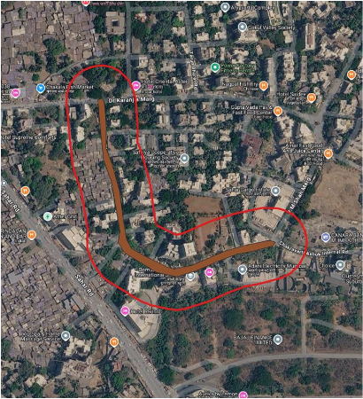

<!-- ---

title: Flood Damage Assessment and Repair Cost Estimation
description: Flood extent mapping, road damage assessment, economic loss estimation, and repair cost estimation for a flooded road in Mumbai.
image: assets/images/profile.png
tags:

* Flood Mapping
* SAR
* Damage Assessment
* Remote Sensing
* Google Earth Engine
* Economic Loss

--- -->

# Flood Damage Assessment and Repair Cost Estimation

## Overview

This project demonstrates a workflow for assessing flood-related road damage and estimating both economic loss and repair cost. The study was carried out for Cardinal Gracias Road, Chakala, Andheri East, Mumbai, using Sentinel-1 SAR imagery, flood-depth information, road construction costs, and damage assessment methods.

## Key Features

* Flood extent mapping using Sentinel-1 SAR
* Before-and-after flood image comparison
* Road flood damage assessment
* Flood depth-based damage ratio estimation
* Economic loss estimation
* Road repair cost estimation
* Integration of remote sensing and infrastructure cost data

## Workflow

1. Define the study area and road asset.
2. Process Sentinel-1 SAR imagery before and after the flood event.
3. Map the flood extent using SAR change detection in Google Earth Engine.
4. Estimate the flood depth from available reference data.
5. Derive the road damage ratio using depth-damage curves.
6. Estimate the road replacement value using Maharashtra SSR rates.
7. Calculate the economic loss.
8. Estimate the repair cost using road repair rates.

## Technologies Used

* Google Earth Engine
* Sentinel-1 SAR
* Remote Sensing
* Flood Change Detection
* GIS
* Python
* Damage Assessment
* Economic Loss Estimation

## Dataset

* **Study Area:** Cardinal Gracias Road, Chakala, Andheri East, Mumbai
* **Event:** Mumbai Floods, July 2026
* **Before-Flood Image:** Sentinel-1, 26 June 2026
* **After-Flood Image:** Sentinel-1, 08 July 2026
* **Road Area:** 3,356.87 m²
* **Road Length:** 460 m
* **Road Width:** 7.5 m
* **Buffer:** 50 m

<!-- ## Results

The estimated average flood depth was approximately **1.75 ft (0.53 m)**, corresponding to a **0.22 damage ratio** based on the selected road depth-damage curve.

* **Road replacement cost:** ₹1,809/m²
* **Estimated economic loss:** ₹13,35,965
* **Road repair rate:** ₹715/m²
* **Estimated repair cost:** ₹5,28,035 -->

## Results

The estimated average flood depth was approximately **1.75 ft (0.53 m)**, corresponding to a **0.22 damage ratio** based on the selected road depth-damage curve.

| Metric                  |            Value |
| ----------------------- | ---------------: |
| Estimated Flood Depth   | 1.75 ft (0.53 m) |
| Damage Ratio            |              22% |
| Road Replacement Cost   |        ₹1,809/m² |
| Estimated Economic Loss |       ₹13,35,965 |
| Road repair rate        |          ₹715/m² |
| Estimated Repair Cost   |        ₹5,28,035 |

### Economic Loss vs Repair Cost

* **Economic Loss:** Estimates the monetary value of the damaged road asset.
* **Repair Cost:** Estimates the cost required to restore the damaged road.

<!-- Detailed maps, damage assessment outputs, and supporting calculations will be added later. -->

## Future Improvements

* Integrate high-resolution imagery for more accurate inundation and damage-area measurement.
* Integrate field-verified flood depth and road condition information.
* Automate road asset valuation and repair cost estimation.
* Extend the workflow to larger urban areas and multiple flood events.
* Integrate the workflow into a flood damage assessment platform.
