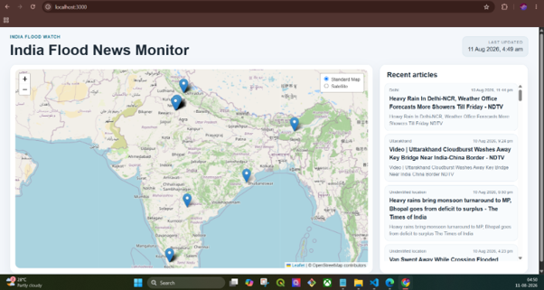

<!-- ---

title: India Flood News Monitor Dashboard
description: A lightweight Web GIS dashboard that collects recent flood-related news and displays reported flood locations across India on an interactive map.
image: assets/images/profile.png
tags:

* Web GIS
* Flood Monitoring
* GIS
* JavaScript
* Data Visualization
* Disaster Management

--- -->

# India Flood News Monitor Dashboard

## Overview

This project demonstrates a lightweight Web GIS dashboard for monitoring recent flood-related news and alerts across India. The dashboard brings information from multiple public news sources into a single interactive map, helping users quickly identify where flooding has been reported without manually checking multiple websites or news sources.

## Key Features

* India-wide flood news monitoring
* Live RSS/Atom feed integration
* Flood-related keyword filtering
* Indian location identification
* Interactive map-based visualization
* Location-based news markers and popups
* Recent articles panel
* Source, headline, time, summary, and original news link
* Duplicate removal and server-side caching
* Last Updated timestamp

## Workflow

1. Fetch recent articles from public RSS/Atom feeds.
2. Filter articles using flood and heavy-rain keywords.
3. Remove duplicate and older articles.
4. Identify Indian cities and states mentioned in the article content.
5. Map recognized locations to geographic coordinates.
6. Display identified flood events as markers on the India map.
7. Show the related news information when a marker is selected.

## Technologies Used

* HTML
* CSS
* JavaScript
* Node.js
* Express.js
* Leaflet
* RSS/Atom Feeds
* OpenStreetMap
* VS Code

## Dataset

* **Data Source:** Public RSS/Atom news feeds
* **Coverage:** India
* **Data Type:** Recent flood-related news and alerts

## Results

The dashboard provides a centralized view of reported flood events across India, displaying identifiable locations along with their related news information.

| Feature | Result |
|---------|--------|
| Geographic Coverage | India |
| News Sources | Multiple public RSS/Atom feeds |
| Flood Filtering | Implemented |
| Location Detection | Indian cities and states |
| Map Visualization | Interactive India map |
| News Information | Headline, source, time, summary and link |
| Data Handling | Duplicate removal and caching |
| Last Updated | Automated |

## Future Improvements

* Integrate additional reliable news and alert sources.
* Improve automated location extraction.
* Add historical flood event analysis.
* Add filtering by date, state, and flood severity.
* Integrate satellite-based flood extent data.
* Deploy the dashboard as an online monitoring platform.
