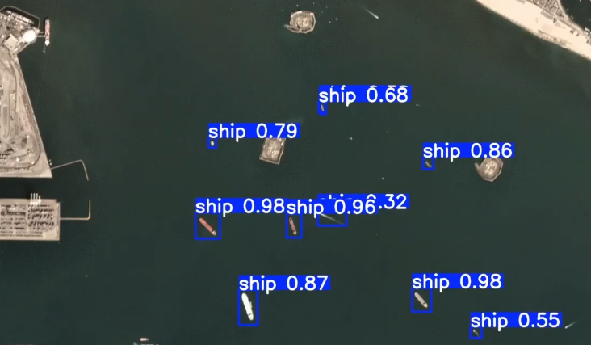

# Ship Detection in Satellite Imagery using YOLOv8

## Overview

This project focuses on detecting ships in satellite imagery using the YOLOv8 object detection model. A pretrained YOLOv8s model was fine-tuned on a Kaggle ship detection dataset to identify ships in unseen satellite images. The project demonstrates the complete workflow from dataset preparation to model training and inference.

## Key Features

- Ship detection in satellite images
- Fine-tuned YOLOv8s model
- Training on a Kaggle dataset
- Detection on unseen test images
- Confidence threshold comparison during inference

## Workflow

1. Prepare and organize the dataset.
2. Configure the dataset using a YAML file.
3. Train the YOLOv8s model.
4. Validate the trained model.
5. Perform inference on test images.
6. Visualize the detection results.

## Technologies Used

- Python
- YOLOv8 (Ultralytics)
- OpenCV
- Matplotlib
- Jupyter Notebook

## Dataset

- **Source:** Kaggle
- **Task:** Ship Detection in Satellite Imagery

## Results

| Metric | Value |
|---------|------:|
| Model | YOLOv8s |
| Training Epochs | 100 |
| Precision | 92.24% |
| Recall | 94.44% |
| mAP@0.5 | 97.84% |
| mAP@0.5:0.95 | 54.04% |

## Future Improvements

- Improve detection accuracy with additional training data.
- Experiment with larger YOLO models.
- Optimize hyperparameters.
- Deploy the model as a web application.

<!-- ## Cover Image

  

 -->

