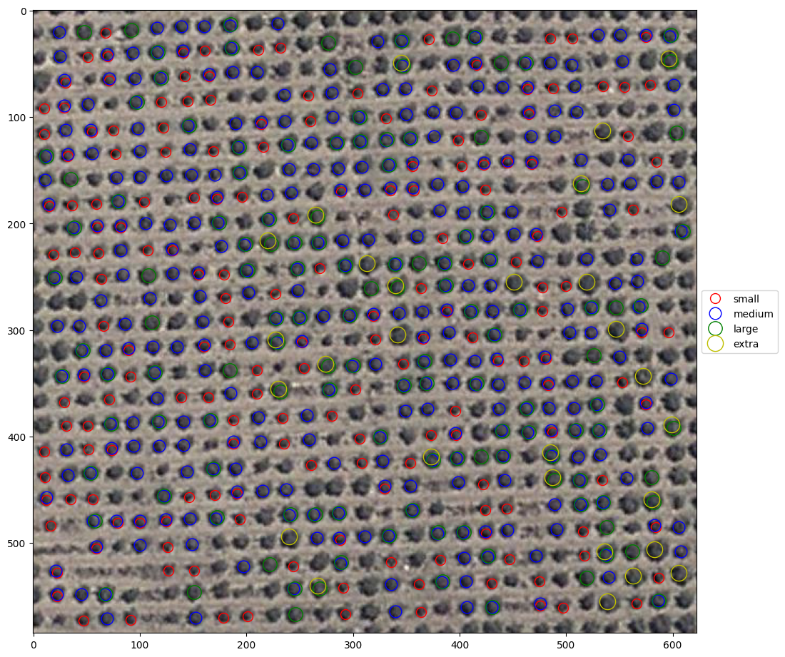

# Tree Counting and Size Detection

## Overview

This project focuses on detecting, counting, and estimating tree sizes from aerial imagery using template matching techniques. Different tree templates were used to identify trees of varying sizes, enabling automated tree counting and size classification.

## Key Features

- Automated tree detection from aerial images
- Single and multiple tree counting
- Tree size classification
- Template matching for feature extraction
- Visualization of detection results

## Project Workflow

1. Load aerial imagery.
2. Select tree templates for different sizes.
3. Perform template matching.
4. Detect tree locations using similarity thresholds.
5. Count detected trees.
6. Classify trees based on template size.
7. Visualize the detection results.

## Technologies Used

- Python
- NumPy
- Pillow (PIL)
- Scikit-image
- Matplotlib
- Jupyter Notebook

## Dataset

- **Input:** PNG aerial imagery
- **Task:** Tree counting and size detection

## Results

| Metric | Value |
|---------|------:|
| Detection Method | Template Matching |
| Library | scikit-image |
| Similarity Threshold | 0.85 |
| Tree Size Categories | 4 (Small, Medium, Large, Extra Large) |
| Output | Tree Count & Size Classification |
| Visualization | Annotated Tree Detection Map |
| Small Trees | 181 |
| Medium Trees | 326 |
| Large Trees | 131 |
| Extra Large Trees | 29 |
| Total Trees Detected | 667 |
| Actual Trees  | 721 |
| Accuracy | 92.51 % |

## Future Improvements

- Apply deep learning models for improved detection.
- Improve performance on dense forest regions.
- Integrate geospatial coordinates for mapping.
- Support multiple tree species classification.