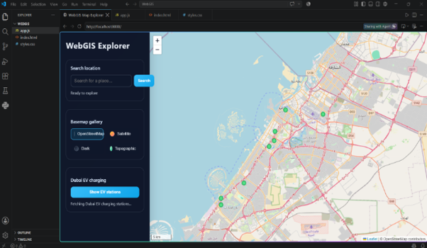

<!-- ---

title: Web GIS Explorer for Dubai EV Charging Stations
description: An interactive web GIS application for exploring maps, locations, basemaps, and electric vehicle charging stations in Dubai.
image: assets/images/profile.png
tags:

* Web GIS
* JavaScript
* Leaflet
* OpenStreetMap
* GIS

--- -->

# Web GIS Explorer for Dubai EV Charging Stations

## Overview

This project demonstrates a lightweight Web GIS application developed using HTML, CSS, and JavaScript. The application provides an interactive map with multiple basemaps, location search, and an EV charging station layer for Dubai using open map data and APIs.

## Key Features

* Interactive web map
* Zoom and pan functionality
* Multiple basemap options
* Location search using OpenStreetMap Nominatim
* Dubai EV charging station overlay
* OpenStreetMap data integration
* Lightweight browser-based application

## Workflow

1. Create the web application using HTML, CSS, and JavaScript.
2. Initialize the interactive map using Leaflet.
3. Add OpenStreetMap and other basemaps.
4. Implement location search using the Nominatim API.
5. Add Dubai EV charging stations using OpenStreetMap data.
6. Add a fallback dataset when the live API is unavailable.
7. Run the application locally using a Python HTTP server.

## Technologies Used

* HTML
* CSS
* JavaScript
* Leaflet
* OpenStreetMap
* Nominatim API
* Overpass API
* Python HTTP Server
* VS Code

## Dataset

* **Map Data:** OpenStreetMap
* **Location Search:** OpenStreetMap Nominatim
* **EV Charging Stations:** OpenStreetMap / Overpass API
* **Study Area:** Dubai, UAE

## Results

| Feature | Result |
|---------|--------|
| Interactive Map | Implemented |
| Basemaps | 4 options |
| Location Search | Implemented |
| EV Charging Stations | Dubai |
| Map Interaction | Zoom and Pan |
| Data Source | OpenStreetMap |
| Application | Local Web GIS |

## Future Improvements

* Add more geospatial datasets and thematic layers.
* Improve EV station data using live API integration.
* Add filtering and spatial query tools.
* Add routing and distance analysis.
* Deploy the application as an online Web GIS platform.
